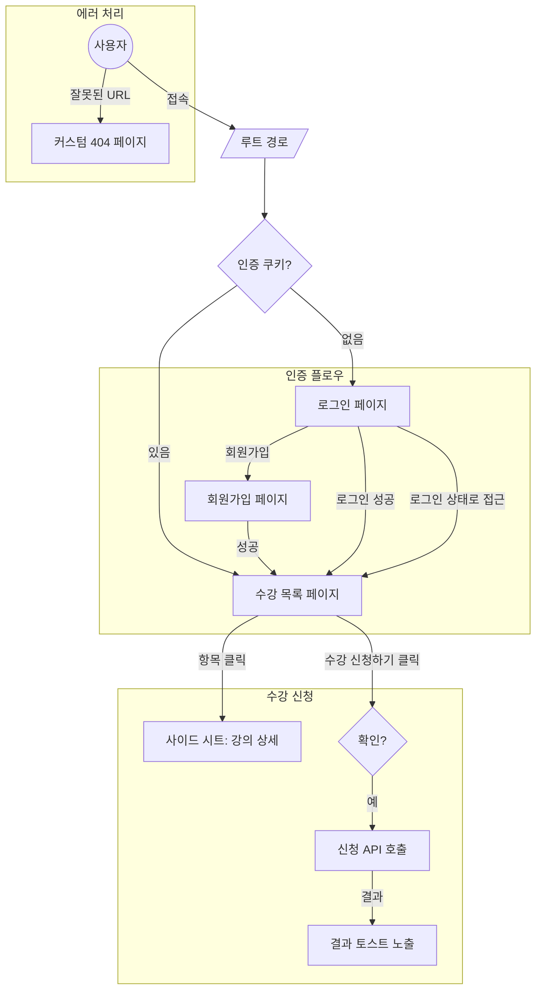

# 수강신청 과제 프로젝트

Next.js 14 (App Router) 기반의 수강신청 서비스 과제 프로젝트입니다.

## 📌 프로젝트 구현 중점 사항

이 프로젝트를 진행하며 고민했던 UX/UI 설계 및 기술적 의사결정 사항들입니다.

### 1. 회원가입 및 입력 폼 최적화

- **전화번호 입력 검증 강화**: 사용자마다 제각각일 수 있는 입력 형식(예: `010-1234-5678` vs `01012345678`)을 통일하기 위해 입력 필드를 3개로 분리했습니다.
- **자동 포커스 이동**: 사용자 편의성을 위해 각 필드의 입력이 완료되거나 Enter 키를 입력하면 자동으로 다음 필드로 포커스가 이동하도록 구현했습니다.
- **오입력 방지**: 비밀번호 확인란을 추가하여 유저가 비밀번호를 잘못 설정할 가능성을 줄였습니다.

### 2. UX 플로우 및 사용자 경험 개선

- **인증 로직 처리**:
  - 로그인 세션(쿠키)이 없으면 즉시 로그인 화면으로 리다이렉트됩니다.
  - **홈 화면 진입 시**: 로그인 상태라면 '수강신청 페이지'로, 비로그인 상태라면 '로그인 페이지'로 자동 분기하여 불필요한 이동을 줄였습니다.
  - **로그인 페이지 접근 제한**: 이미 로그인한 유저는 로그인 페이지에 접근할 수 없도록 처리했습니다.
- **수강 신청 인터랙션**:
  - 신청 버튼 클릭 시 **확인 Dialog**를 띄워 사용자의 의도를 재확인합니다.
  - 신청 결과는 **Toast 메시지**를 통해 즉각적이고 명확하게 피드백합니다.
- **강의 상세 정보 (Bottom Sheet)**: 페이지 이동 없이 맥락을 유지하며 상세 내용을 확인할 수 있도록 **Bottom Sheet** UI를 채택했습니다.
- **404 페이지 커스터마이징**: 프레임워크 기본 페이지 대신 서비스 톤앤매너에 맞춘 커스텀 404 페이지를 제작하여, 잘못된 경로 접근 시에도 일관된 경험을 제공합니다.
- **CLS(Layout Shift) 최소화**: 데이터 로딩 중 화면이 덜컹거리는 현상을 막기 위해 주요 영역에 **Skeleton UI**를 적용했습니다.
- **리스트 렌더링 전략**: 현재 데이터 규모 상 브라우저 부하가 크지 않다고 판단하여 List Virtualization은 적용하지 않았습니다. (추후 데이터 급증 시 도입 고려)

### 3. 기술적 구현 사항

- **보안을 고려한 토큰 관리**: Next.js의 Proxy API Route를 구축하여 Access Token을 브라우저의 일반 스토리지가 아닌 **HttpOnly Cookie**로 관리합니다. 이를 통해 클라이언트 사이드 보안 위협(XSS 등)에 대한 저항력을 높였습니다.

---

## 사용 패키지 (Tech Stack)

주요 사용 패키지 및 라이브러리 버전입니다.

- **Framework**: Next.js 16
- **Library**: React 19
- **Language**: TypeScript 5
- **Styling**: Tailwind CSS 4, Framer Motion, clsx, tailwind-merge
- **Data Fetching**: TanStack Query 5, Axios
- **Form Management**: React Hook Form, Zod
- **UI Components**: Radix UI, Lucide React, Sonner (Toast)

---

## 📂 프로젝트 구조

```text
.
├── app
│   ├── (auth)          # 로그인, 회원가입 관련 페이지
│   ├── api             # Next.js API Routes (Proxy 등)
│   ├── courses         # 수강신청 목록 및 메인 페이지
│   ├── instructor      # 강사 관련 페이지
│   ├── globals.css     # 전역 스타일
│   ├── layout.tsx      # 전역 레이아웃
│   ├── not-found.tsx   # 커스텀 404 페이지
│   ├── page.tsx        # 루트 페이지 (리다이렉트 로직)
│   └── providers.tsx   # QueryClientProvider 등 설정
├── lib
│   ├── apis            # 백엔드 API 호출 모듈
│   ├── components      # 재사용 가능한 UI 컴포넌트
│   ├── constants       # 상수 데이터 관리
│   ├── context         # 전역 상태 관리 (AuthContext 등)
│   ├── http            # Axios 인스턴스 및 인터셉터 설정
│   ├── queries         # TanStack Query (React Query) 훅
│   ├── react-query     # QueryClient 설정 및 옵션
│   ├── types           # TypeScript 타입 정의
│   └── utils           # 유틸리티 함수
└── public              # 정적 에셋
```

## UX 플로우 (User Flow)



---

## 개발 서버 시작하기

```bash
# Install dependencies
npm install
# or
yarn
# or
pnpm install

# Run development server
npm run dev
# or
pnpm dev
```

브라우저에서 [http://localhost:3000](http://localhost:3000)으로 접속합니다.
